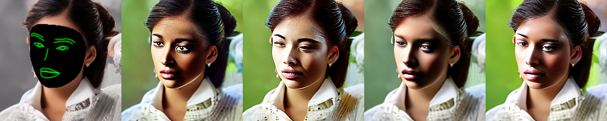

# controlnet_de_identification
ControlNet Using the Facial Landmark Condition for De-identification Purposes

---
license: creativeml-openrail-m
base_model: stabilityai/stable-diffusion-2-1-base
tags:
- stable-diffusion
- stable-diffusion-diffusers
- text-to-image
- diffusers
- controlnet
inference: true
---
    
### controlnet-saeu5407/controlnet-landmark

These are controlnet weights trained on stabilityai/stable-diffusion-2-1-base with new type of conditioning.
You can find some example images below.

prompt: a women wearing white shirt
