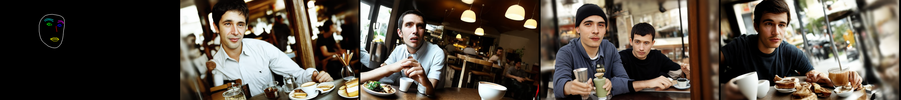

# controlnet_de_identification
ControlNet Using the Facial Landmark Condition for De-identification Purposes

---
license: creativeml-openrail-m
base_model: stabilityai/stable-diffusion-2-1-base
tags:
- stable-diffusion
- stable-diffusion-diffusers
- text-to-image
- diffusers
- controlnet
inference: true
---
    
# saeu5407/controlnet-landmark

These are controlnet weights trained on stabilityai/stable-diffusion-2-1-base with new type of conditioning.

The model was trained based on 256x256 single person images.

It also shows appropriate performance for large-sized images other than 256x256.

You can find some example images below.

prompt: a middle-aged black rapper in a black hat

prompt: a men in cafe

